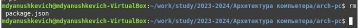

					РОССИЙСКИЙ УНИВЕРСИТЕТ ДРУЖБЫ НАРОДОВ
				Факультет физико-математических и естественных наук
					Кафедра прикладной информатики
					ОТЧЕТ ПО ЛАБОРАТОРНОЙ РАБОТЕ №2
					дисциплина: Архитектура компьютера
						Янушкевич Михаил
						Группа: НПИбд-02-23

# Содержание
1. Цель работы
2. Задание
3. Выполнение лабораторной работы
4. Вывод

# Цель работы

Целью работы является изучить идеологию и применение средств контроля версий. Приобрести
практические навыки по работе с системой git.

# Задание
1. Созадние и настройка Github
2. Создание ssh-ключа
3. Создание рабочего пространства и репозитория
4. Настройка каталогов курса
5. Задание для самостоятельной работы 

# Выполнение лабораторной работы

1. Создаём учетную запись на Github
2. 
2.1 В терминале вводим команды, указывая имя и email владельца(рис.1).
 
рис.1 Создаём предварительную конфигурацию git.

2.2 Настраиваем utf-8(рис.2).

рис.2 Вводим команду для настройки

2.3 Задаём имя начальной ветки(рис.3).

рис.3 Называем начальную ветку(master)

2.4 Настраиваем параметр autocrlf(рис.4).

рис.4 Вводим указанный параметр

2.5 Настраиваем параметр safecrlf(рис.5).

рис.5 Вводим указанный параметр

3. 
3.1 Создание ssh-ключа(рис.6).

рис.6 Вводим команду ssh-keygen для генераци ssh-ключа

3.2 Выводим созданный ключ(рис.7).

рис.7 С помощью команды cat выводим ssh-ключ

3.3 Активация ключа(рис.8).

рис.8 Активируем ssh-ключ в Github

4. 
4.1 Создание каталога «Архитектура компьютера»(рис.9).

рис.9 С помощью команды mkdir создаём новый каталог

4.2 Открыть терминал и перейти в каталог курса(рис.10).

рис.10 С помощью команды cd переходим в каталог "Архитектура компьютера"

4.3 Клонирование созданного репозитория(рис.11).

рис.11 С помощью команды clone копируем созданный репозиторий в "arch-pc"

5. 
5.1 Перейти в каталог курса(рис.12).

рис.12 С помощью команды cd переходим в каталог arch-pc

5.2 Удалить лишние файлы(рис.13).

рис.13 С помощью команды rm удаляем лишние файлы

5.3 Создать необходимые каталоги(рис.14,15).

рис.14,15 с помощью команд echo и make создаём каталоги

5.4 Отправить файлы на сервер(рис.16).

рис.16 С помощью команд git add, git commit, git push отправляем файлы на удаленный сервер

5.5 Убедиться в правильности созадния рабочего пространства(рис.17).

рис.17 Заходим в репозиторий и видим, что рабочее пространство создано верно

# Вывод

В данной лабораторной работе я научился создавать рабочее пространство и репозитории в
github на основе пердоставленного шаблона для того, чтобы связывать локальный репозиторий с сервером, испозьзуя
командную строку ОС Linux. Мы использовали клонирование, копирование, стягивание и отправку
данных на сервер, а также множество других команд.

