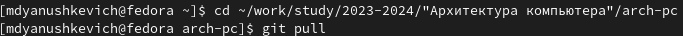
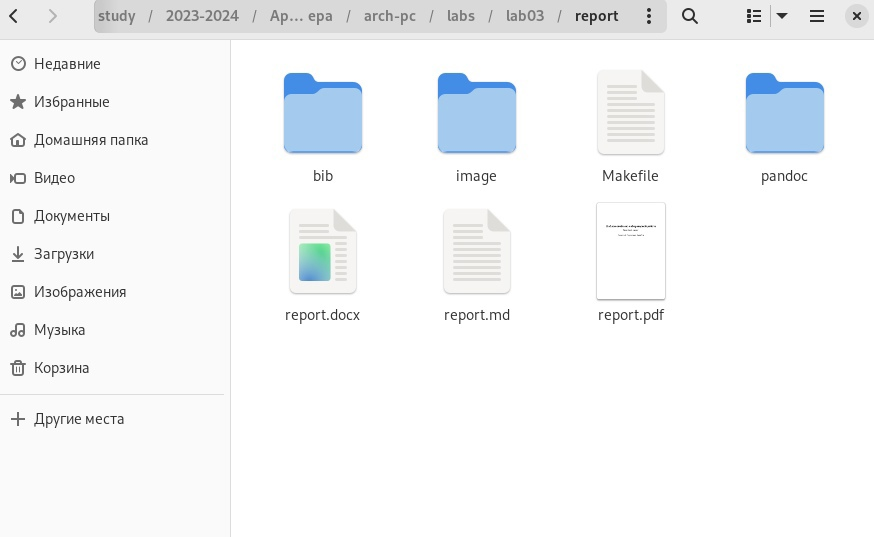
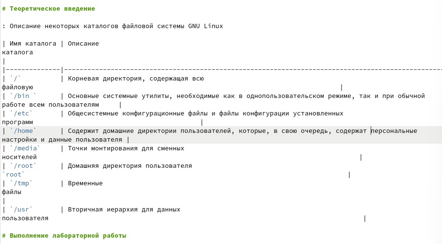
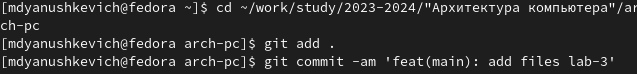
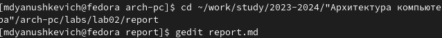

					РОССИЙСКИЙ УНИВЕРСИТЕТ ДРУЖБЫ НАРОДОВ
				Факультет физико-математических и естественных наук
					Кафедра прикладной информатики
					Отчёт по лаборатной работе №3
					дисциплина: Архитектура компьютера 
						Янушкевич Михаил
						Группа: НПИбд-02-23
					
# Содержание
1. Цель работы
2. Выполнение лабораторной работы
3. Задания для самостоятельной работы
4. Вывод
			
# Цель работы

Целью работы является освоение процедуры оформления отчетов с помощью легковесного языка разметки Markdown.

# Выполнение лабораторной работы

1. Перейти в сформированный каталог курса лабораторной работы №2 и обновить локальный репозиторий(рис.1).

рис.1
С помощью команды cd переходим в каталог, с помощью git pull стягиваем изменения из удаленного репозитория.

2. Перейти в каталог по лабораторной работе №3(рис.2).

рис.2
С помощью команды cd переходим в каталог report, далее с помощью make создаём файлы типа docx. и pdf.

3. Проверить наличие созданных файлов(рис.3).

рис.3
Проверяем наличие созданных файлов в указанном каталоге

4. Удалить полученные файлы и открыть файл report.md(рис.4).

рис.4
С помощью команды make clean удаляем оба файла, далее открываем текстовый редактор gedit.

5. Редактируем шаблон, описываем лабораторную работу(рис.5).

рис.5

6. Загружаем файлы на Github(рис.6).

рис.6

# Задание для самостоятельной работы

1. В соответствующем каталоге сделайте отчёт по ЛБ №2 в формате Markdown(рис.7).

рис.7

2. Загрузите файлы на Github(рис.8).

рис.8

# Вывод

В ходе выполнения лабораторной работы №3 я освоил работу с легковесным языком разметки Markdown, а также закрепил знания по работе с Github  и ОС Linux.

