					Российский Университет Дружбы Народов
				Факультет физико-математических и естественных наук
					Кафедра прикладной информатики
						Лабораторная работа №4
						Студент: Янушкевич Михаил
						Группа: НПИбд-02-23

# Содержание
1. Цель работы
2. Выполнение лабораторной работы
3. Задание для самостоятельной работы
4. Вывод

# Цель работы

Освоение процедуры компиляции и сборки программ, написанных на ассемблере NASM.

# Выполнение лабораторной работы
1. Создать каталог для работы с программами на языке ассемблера NASM(рис.1).
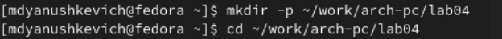
С помощью команды mkdir создаём необходимый каталог и переходим в него.

2. Создать текстовый файл hello.asm(рис.2).

С помощью команды touch создаём текстовый файл и открываем его в текстовом редакторе gedit.

3. Ввести в текстовый файл необходимый текст(рис.3).
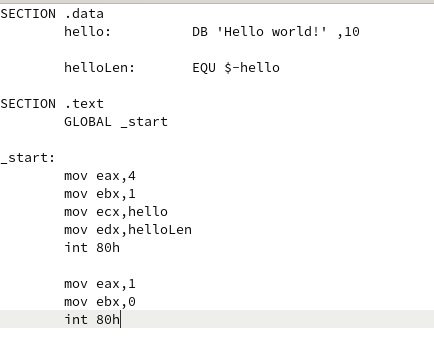
В текстовом редакторе gedit редактируем файл, вводим необходимый текст.

4. Скомпилировать созданную программу(рис.4).

Вводим необходимую команду, чтобы преобразовать текст из файла в объектный код, который запишется в файл hello.o.

5. Выполнить необходимую команду(рис.5.).

С помощью введенной команды скомпилируем исходный файл в объектный.

6. Проверить наличие всех созданных ранее файлов(рис.6).
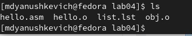
С помощью команды ls проверяем, что все файлы были успешно созданны и преобразованны.

7. Ввести необходимую команды(рис.7).
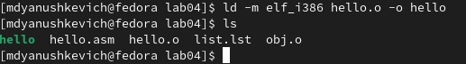
Вводим необходимую команду, чтобы передать объектный файл на обработку компановщику, далее с помощью команды ls убеждаемся, что исполняемый файл был создан.

8. Выполнить следущую команду(рис.8).
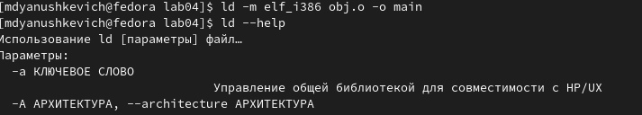
С помощью введенной команды задаём имя создаваемого исполняемого файла.

9. Запустить исполняемый файл(рис.9).
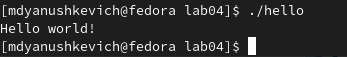
С помощью введенной команды выводим в командой строке содержимое исполняемого файла.

# Задание для самостоятельной работы

1. В каталоге lab04 с помощью команды cp создать копию файла hello.asm с именем lab4.asm(рис.10).
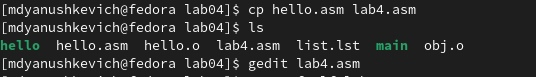
С помощью команды cp создаём файл lab4.asm, далее открываем в в текстовом редакторе gedit.

2. В файле lab4.asm внести необходимые изменения(рис.11).
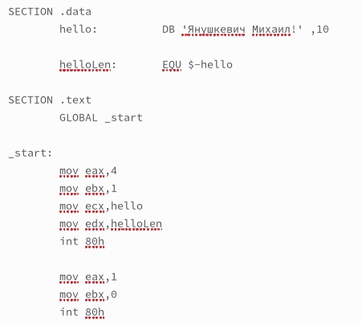
Редактируем файл, вместо "Hello world!" вводим "Янушкевич Михаил".

3. Оттранслировать текст программы в объектный файл, скомпоновать его и запустить получившийся исполняемый файл(рис.12).
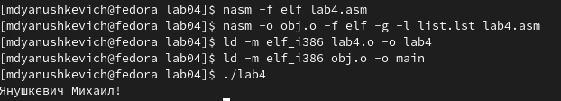
Вводим все необходимые программы, чтобы скомпилировать объектный файл, скомпоновать его и вывести в командной строке.

4. Скопировать файлы hello.asm и lab4.asm в локальный репозиторий(рис.13).
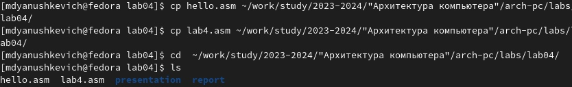
С помощью команды cp копируем файлы hello.asm и lab4.asm в локальный репозиторий

5. Загрузить файлы на Github(рис.14).

С помощью команды git push загружаем созданные файлы на Github.

6. Убеждаемся, что файлы загружены на Github(рис.15).
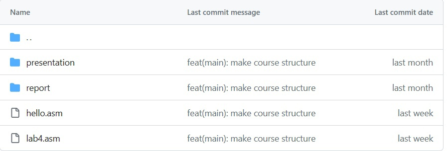

# Выводы

Благодаря этой лабораторной работе я освовил базовые навыки компиляции программ с помощью ассемблера NASM, а также закрепил полученные ранее умения по работе с командной строкой ОС Linux.

