					Российский Университет Дружбы Народов
				Факультет физико-математических и естественных наук
					Кафедра прикладной информатики
						Лабораторная работа №5
						Студент: Янушкевич Михаил
						Группа: НПИбд-02-23

# Содержание
1. Цель работы
2. Выполнение лабораторной работы
3. Задание для самостоятельной работы
4. Вывод

# Цель работы

Приобретение практических навыков работы в Midnight Commander. Освоение инструкций
языка ассемблера mov и int.

# Выполнение лабораторной работы

1. Открыть Midnight Commander(рис.1).
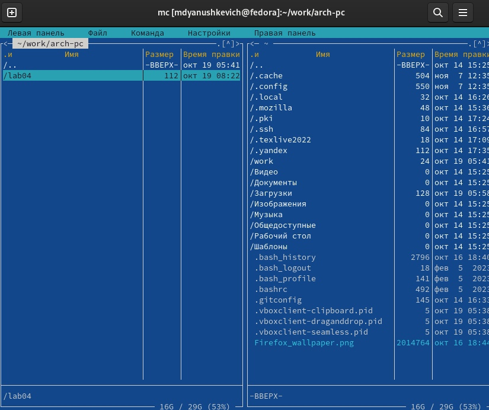
С помощью команды "мс" открываем Midnight Commander

2. Перейти в каталог arch-pc и создать папку lab05(рис.2).
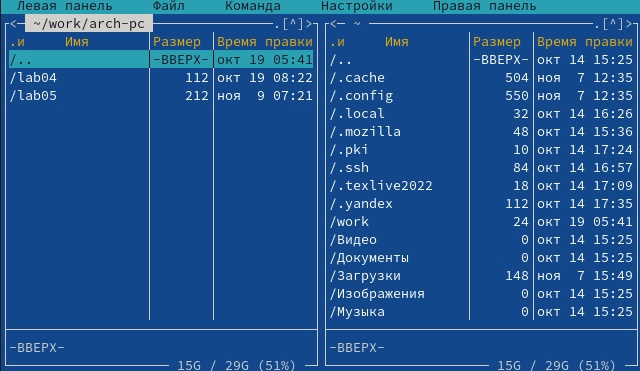
С помощью функциональных стрелочек на клавиатуре переходим в каталог arch-pc, далее с помощью клавиши f7 создаём папку lab05 и переходим в неё.

3. Создать файл lab5-1.asm(рис.3).
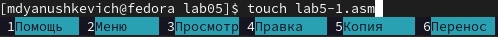
В командной строке, используя команду touch, создаём файл lab5-1.asm

4. Открыть файл lab5-1.asm и ввести необходимый текст(рис.4).
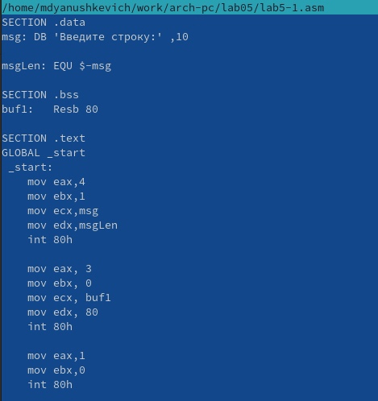
С помощью клавиши f4 открываем файл lab5-1.asm в редакторе mcedit и вводим текст программы из листинга 5.1.

5. Оттранслировать текст программы в объектный файл и запустить исполняемый файл(рис.5).
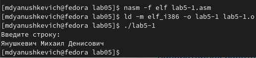
В командной строке вводим необходимые команды, чтобы оттранслировать текст программы lab5-1.asm в объектный файл. Далее запускаем объектный файл, вводим своё ФИО для проверки корректности выполнения.

6. Скачать файл in_out.asm. Файл in_out.asm должен лежать в одном и том же каталоге, что и файл с программой.(рис.6).
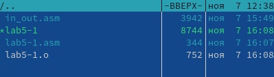
Скачиваем файл со страницы курса в ТУИС. Чтобы перенести файл in_out.asm в тот же каталог, что и файл с программой, скопируем файл lab5-1.asm с помощью клавиши f7.

7. Создать копию файла lab5-1.asm с именем lab5-2.asm(рис.7).
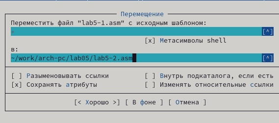
Используя клавишу f6 создаём копию файла lab5-1.asm с именем lab5-2.asm.

8. Исправить текст программы с использованием внешнего файла in_out.asm.(рис.8,9).
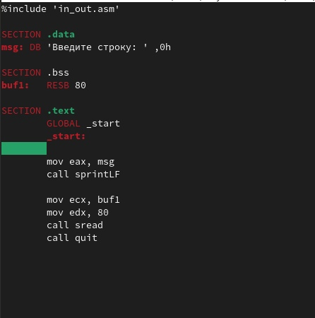

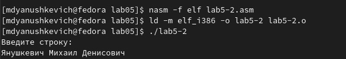
В соответствии с листингом 5.2 исправляем текст файла lab5-2.asm с использованием подпрограмм из внешнего файла in_out.asm. Далее создаём исполняемый файл и проверяем его работу, вводя своё ФИО.

9. В файле lab5-2.asm заменить подпрограмму sprintLF на sprint.(рис.10,11).

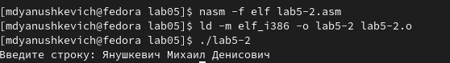
В редакторе изменяем текст программы, заменяя подпрограмму sprintLF на sprint. Далее создаём исполняемый файл, запускаем его и проверяем, вводя своё ФИО. Можно увидеть, что теперь вводимый с клавиатуры текст выводится в одну строчку. 

# Задание для самостоятельной работы

1. Создать копию файла lab5-1.asm и внести необходимые изменения.(рис.12). 
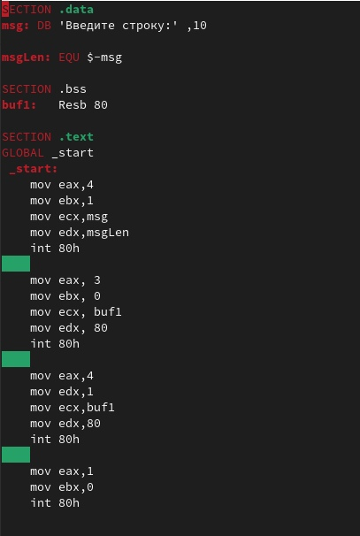
Создаём копию файла lab5-1.asm под названием lab5-3.asm. Вносим необходимые изменения в текст файла lab5-3.asm.

2. Создать исполняемый файл и проверить его работу.(рис.13).
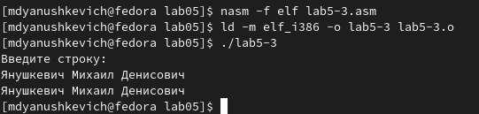
Вводим необходиые команды в командную строку, чтобы создать исполняемый файл. Далее проверяем его работу, вводя своё фИО. 

3. Создать копию файла lab-2.asm и внести необходимые изменения с использованием внешнего файла in_out.asm(рис.14).
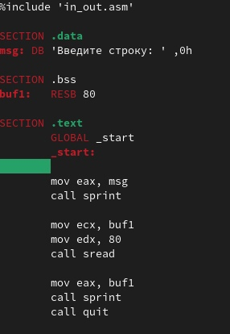
Создаём копию файла lab5-2.asm под названием lab5-4.asm. Вносим необходимые изменения в текст файла lab5-4.asm с использованием внешнего файла in_out.asm. 

4. Создать  исполняемый файл и проверить его работу.(рис.15).
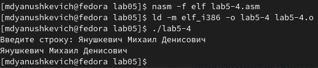
Вводим необходимые команды в командную строку, чтобы создать исполняемый файл. Далее проверяем его работу, вводя своё ФИО.

# Вывод

Благодаря этой лабораторной работе я освоил базовые навыки владения Midnight Commander, а также познакомился с  функциями mov и int языка ассемблера. 

