					Российский Университет Дружбы Народов
				Факультет физико-математических и естественных наук
					Кафедра прикладной информатики
						Лабораторная работа №6
						Студент: Янушкевич Михаил
						Группа: НПИбд-02-23

# Содержание
1. Цель работы
2. Выполнение лабораторной работы
3. Задание для самостоятельной работы
4. Вывод

# Цель работы

Освоение арифметических инструкций языка ассемблера NASM.

# Выполнение лабораторной работы
1. Создать каталог для программ лабораторной работы №6, в нём создать файл lab6-1.asm.(рис.1).
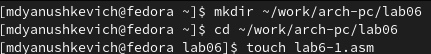
С помощью команды mkdir создаём каталог lab06, далее в нём, с помощью команды touch создаём файл lab6-1.asm.

2. В файл lab6-1.asm ввести текст программы из листинга 6.1.(рис.2).
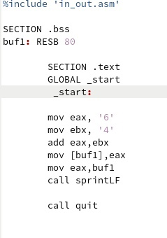
Открываем файл lab6-1.asm в редакторе gedit, вводим необходимый текст из листинга 6.1.

3. Создать исполняемый файл и запустить его.(рис.3).
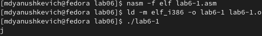
В командной строке вводим необходимые команды, чтобы создать из текстового файла исполняемый, далее запускаем его. Результатом выполения программы становится символ "j".

4. Изменить текст программы, заменяя символы регистрами чисел.(рис.4,5).
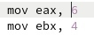

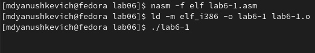
Текст из листинга 6.1 изменяем, заменяя необходимые строки. Далее создаём исполняемый файл,запускаем файл. Результат работы программы не выводится на экран. Опираясь на таблицу ASCII, можно понять, что код 10 соответсвует символу "пробел", который и является результатом выполнения программы.

5. Создать файл lab6-2.asm.и ввести в него текст программы из листинга 6.2.(рис.6,7).

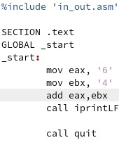
В каталоге lab06 создаём файл lab6-2.asm и вводим в него текст программы из листинга 6.2.

6. Создать исполняемый файл и запустить его.(рис.8).
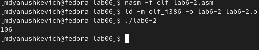
В командной строке вводим необходимые команды, чтобы создать исполняемый файл. Далее запускаем его. Результатом работы программы будет число 106.

7. Заменить необходимые строки в тексте листинга 6.2. Создать исполняемый файл и запустить его.(рис.9,10).
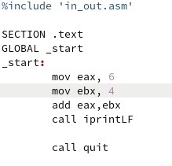

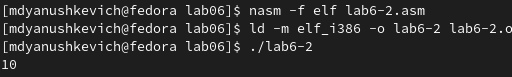
В тексте файла lab6-2.asm заменяем необходимые строки. Далее создаём исполняемый файл, запускаем его. Как можно увидеть, результатом работы программы будет число 10.

8. В тексте файла lab6-2.asm заменить функцию iprintLF на iprint.(рис.11,12).

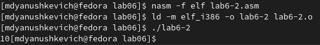
В файле lab6-2.asm заменяем функцию iprintLF на iprint. Создаём исполняемый файл и запускаем программу. Результатом выполнения программы будет число 10. В отличие от вывода функции iprintLF, iprint выводит результат в одну строчку.

9. Создать файл lab6-3.asm в каталоге lab06. В файл ввести текст программы из листинга 6.3. Создать исполняемый файл и запустить его.(рис.13,14,15).

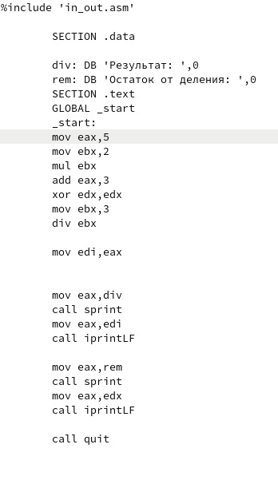
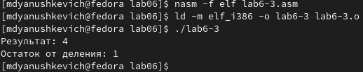
С помощью команды touch создаём файл lab6-3.asm. Открываем его и вводим текст из листинга 6.3. Создаём исполняемый файл и запускаем программу. Результатом работы программы будет число 4, а остаток будет равняться 1.

10. Изменить текст программы из файла lab6-3.asm для вычисления выражения 𝑓(𝑥) = (4 ∗ 6 + 2)/5. (рис.16,17).
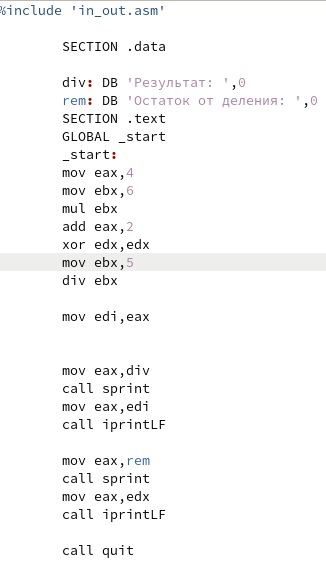
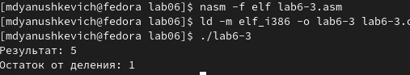
В файле lab6-3.asm вносим необходимые изменения, чтобы вычислить выражение 𝑓(𝑥) = (4 ∗ 6 + 2)/5. Далее создаём исполняемый файл, проверяем его работу. Результатом исполнения программы будет число 5, а в остатке будет 1.

11. Создать файл variant.asm в каталоге lab06. В этот файл ввести текст программы из листинга 6.4. Создать исполняемый файл программы и запустить его.(рис.18,19,20)

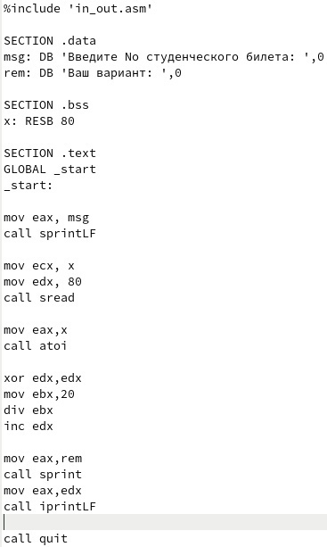
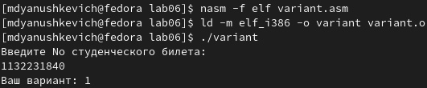
С помощью команды touch создаём файл variant.asm в каталоге lab06. Открываем этот файл и вводим в него текст из листинга 6.4. Эта программа вычисляет вариант задания по номеру студенческого билета. Далее запускам программу, вводим номер ст.билета(мой номер-1132231840). В результате выводится число 1, что означает, что мне достался вариант №1.

# Ответы на вопросы

1. Строки, отвечающие за вывод на экран сообщения "Ваш вариант:" mov eax,rem,  call sprint.

2. Эти конструкции используются для ввода сообщения с клавиатуры. В eax записывается адрес переменной, в которую сообщение будет записано, в edx указывается длина вводимой строки.

3. Call atoi используется для преобразования ASCII чисел в целые числа.

4. mov eax,x    - Строки, отвечающие за вычисление варианта.
   call atoi
   xor edx,edx 
   mov ebx,20
   div ebx
   inc edx
   
5. Остаток записывается в регистр edx.

6. Эта функция считывает значение eax, прибавляет к нему 1, а потом перезаписывает обратно в eax.

7. mov eax,edx    - Строки, отвечающие за вывод результата вычислений.
   call iprintLF
   

# Задание для самостоятельной работы

1. Создать файл в формате asm. В нём написать программу вычисления выражения y=f(x). Вид функции соответствует номеру варианта из предыдущего задания лабораторной работы.(рис.21).
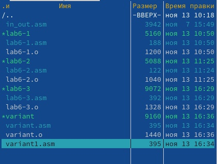
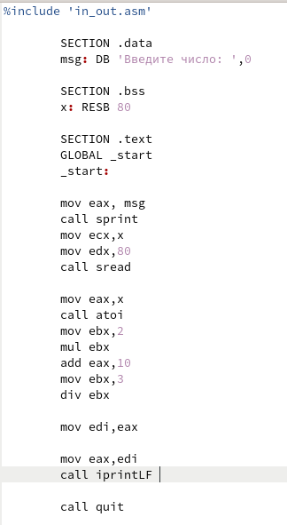
Создаём файл variant1.asm, с помощью midnight commander убеждаемся в его создании. Далее открываем его и на основе полученных ранее знаниях пишем программу, которая будет вычислять выражение y=(10+2x)/3, где х1=1, х2=10. 

2. Запустить написанную программу и проверить её работу.(рис.23).
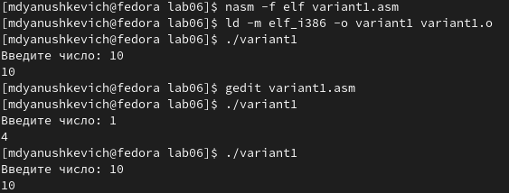
После написания программы создаём объектный файл, запускаем программу. Для этого поочерёдно вводим в строку значения х. Ответами являются числа 4 и 10, из чего можно сделать вывод, что программа написана верно. 

# Выводы

Благодаря этой лабораторной работе я освоил арифметические инструкции языка ассемблера NASM, что позволило мне написать полноценную программу по вычислению выражения типа y=f(x). Также я закрепил полученные ранее навыки по работе с командной строкой ОС Linux и языком ассемблера NASM.
