---
## Front matter
title: "Отчёт по лабораторной работе №7"
subtitle: "Простейший вариант"
author: "Янушкевич Михаил Денисович"

## Generic otions
lang: ru-RU
toc-title: "Содержание"

## Bibliography
bibliography: bib/cite.bib
csl: pandoc/csl/gost-r-7-0-5-2008-numeric.csl

## Pdf output format
toc: true # Table of contents
toc-depth: 2
lof: true # List of figures
lot: true # List of tables
fontsize: 12pt
linestretch: 1.5
papersize: a4
documentclass: scrreprt
## I18n polyglossia
polyglossia-lang:
  name: russian
  options:
	- spelling=modern
	- babelshorthands=true
polyglossia-otherlangs:
  name: english
## I18n babel
babel-lang: russian
babel-otherlangs: english
## Fonts
mainfont: PT Serif
romanfont: PT Serif
sansfont: PT Sans
monofont: PT Mono
mainfontoptions: Ligatures=TeX
romanfontoptions: Ligatures=TeX
sansfontoptions: Ligatures=TeX,Scale=MatchLowercase
monofontoptions: Scale=MatchLowercase,Scale=0.9
## Biblatex
biblatex: true
biblio-style: "gost-numeric"
biblatexoptions:
  - parentracker=true
  - backend=biber
  - hyperref=auto
  - language=auto
  - autolang=other*
  - citestyle=gost-numeric
## Pandoc-crossref LaTeX customization
figureTitle: "Рис."
tableTitle: "Таблица"
listingTitle: "Листинг"
lofTitle: "Список иллюстраций"
lotTitle: "Список таблиц"
lolTitle: "Листинги"
## Misc options
indent: true
header-includes:
  - \usepackage{indentfirst}
  - \usepackage{float} # keep figures where there are in the text
  - \floatplacement{figure}{H} # keep figures where there are in the text
---

# Содержание
1. Цель работы
2. Выполнение лабораторной работы
3. Задание для самостоятельной работы
4. Вывод

# Цель работы

Освоение процедуры компиляции и сборки программ, написанных на ассемблере NASM.

# Выполнение лабораторной работы
1. Создать каталог для программ ЛБ №7. Перейти в него, создать файл lab7-1.asm
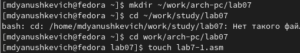
С помощью команды mkdir создаём каталог lab07, далее переходим в него и с помощью команды touch создаём файл lab7-1.asm

2. В файл lab7-1.asm ввести программу из листинга 7.1.(рис.2).
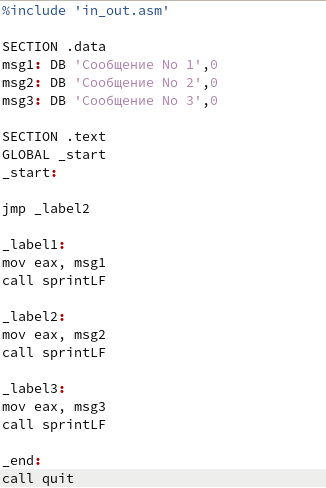
Открываем файл lab7-1.asm и водим в него программу с использование инструкции jmp из листинга 7.1 

3. Создать исполняемый файл программы и запустить его(рис.3).
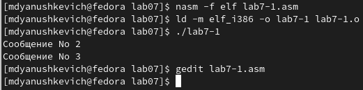
В командную строку вводим необходимые команды, чтобы создать исполняемый файл и запустить его. Результатом работы программы будут числа 2 и 3.

4. Изменить текст программы в соответствии с листингом 7.2.(рис.4).
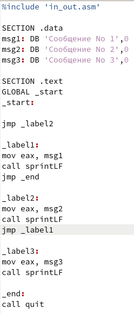
В файл lab 7-1.asm вносим необходимые изменения из листинга 7.2.

5. Создать исполняемый файл и запустить его.(рис.5.).
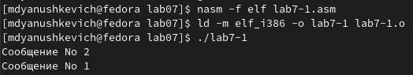
В командной строке вводим необходимые команды, чтобы создать объектный файл с измененной программой из листинга 7.2. Далее запускаем этот файл. Результатом работы программы будут три последовательных числа: 3 2 1. 

6. Создать файл lab7-2.asm  в каталоге lab07. В него ввести текст программы из листинга 7.3.(рис.6).
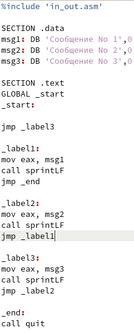
С помощью команды touch создаём файл lab7-2.asm. Далее открываем его и вводим необходимый код из листинга 7.3.

7. Создать исполняемый файл и проверить его работу.(рис.7).
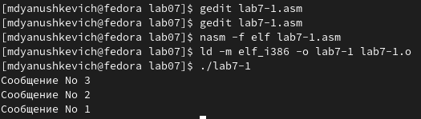
В командную строку вводим необходимые команды, чтобы создать исполняемый файл и запустить его. Вводя разные значения В мы понимаем, что программа работает исправно.

8. Создать файл листинга  для программы из файла lab7-2.asm. Открыть файл листинга с помощью любого текстового редактора.(рис.8).
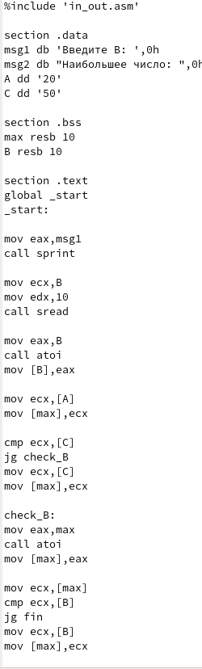
В командной строке прописываем команду для создания файла листинга. Далее с помощью редактора mcedit открываем файл lab7-2.lst.

9. Открыть файл с программой lab7-2.asm. В ней в одной из инструкций удаляем операнд. (рис.9).
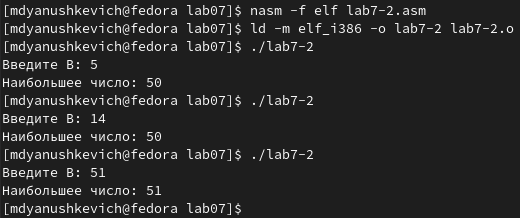

# Задание для самостоятельной работы

1. (рис.10).
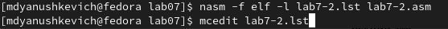

2. (рис.11).
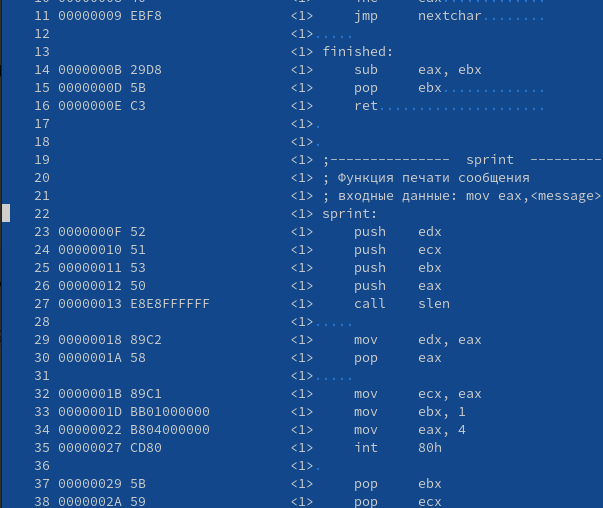

(рис.12).
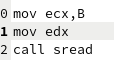

4. (рис.13).
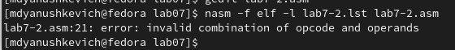
С помощью команды cp копируем файлы hello.asm и lab4.asm в локальный репозиторий

5. (рис.14).

6.(рис.15).

# Выводы

