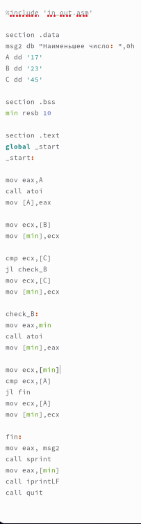
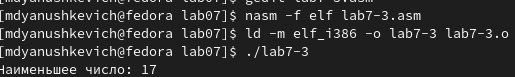
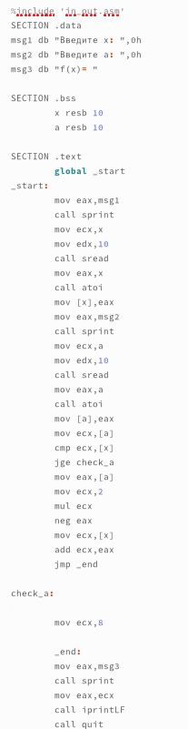
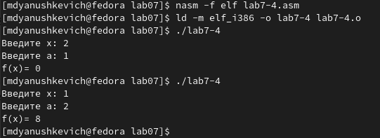

---
## Front matter
title: "Отчёт по лабораторной работе №7"
subtitle: "Простейший вариант"
author: "Янушкевич Михаил Денисович"

## Generic otions
lang: ru-RU
toc-title: "Содержание"

## Bibliography
bibliography: bib/cite.bib
csl: pandoc/csl/gost-r-7-0-5-2008-numeric.csl

## Pdf output format
toc: true # Table of contents
toc-depth: 2
lof: true # List of figures
lot: true # List of tables
fontsize: 12pt
linestretch: 1.5
papersize: a4
documentclass: scrreprt
## I18n polyglossia
polyglossia-lang:
  name: russian
  options:
	- spelling=modern
	- babelshorthands=true
polyglossia-otherlangs:
  name: english
## I18n babel
babel-lang: russian
babel-otherlangs: english
## Fonts
mainfont: PT Serif
romanfont: PT Serif
sansfont: PT Sans
monofont: PT Mono
mainfontoptions: Ligatures=TeX
romanfontoptions: Ligatures=TeX
sansfontoptions: Ligatures=TeX,Scale=MatchLowercase
monofontoptions: Scale=MatchLowercase,Scale=0.9
## Biblatex
biblatex: true
biblio-style: "gost-numeric"
biblatexoptions:
  - parentracker=true
  - backend=biber
  - hyperref=auto
  - language=auto
  - autolang=other*
  - citestyle=gost-numeric
## Pandoc-crossref LaTeX customization
figureTitle: "Рис."
tableTitle: "Таблица"
listingTitle: "Листинг"
lofTitle: "Список иллюстраций"
lotTitle: "Список таблиц"
lolTitle: "Листинги"
## Misc options
indent: true
header-includes:
  - \usepackage{indentfirst}
  - \usepackage{float} # keep figures where there are in the text
  - \floatplacement{figure}{H} # keep figures where there are in the text
---

# Цель работы

Освоение процедуры компиляции и сборки программ, написанных на ассемблере NASM.

# Выполнение лабораторной работы
1. Создать каталог для программ ЛБ №7. Перейти в него, создать файл lab7-1.asm. (рис. @fig:001)

{#fig:001 width=70%}

С помощью команды mkdir создаём каталог lab07, далее переходим в него и с помощью команды touch создаём файл lab7-1.asm

2. В файл lab7-1.asm ввести программу из листинга 7.1.(рис. @fig:002)

{#fig:002 width=70%}

Открываем файл lab7-1.asm и водим в него программу с использование инструкции jmp из листинга 7.1 

3. Создать исполняемый файл программы и запустить его.(рис. @fig:003)

{#fig:003 width=70%}

В командную строку вводим необходимые команды, чтобы создать исполняемый файл и запустить его. Результатом работы программы будут числа 2 и 3.

4. Изменить текст программы в соответствии с листингом 7.2.(рис. @fig:004)

{#fig:004 width=70%}

В файл lab 7-1.asm вносим необходимые изменения из листинга 7.2.

5. Создать исполняемый файл и запустить его.(рис. @fig:005)

{#fig:005 width=70%}

В командной строке вводим необходимые команды, чтобы создать объектный файл с измененной программой из листинга 7.2. Далее запускаем этот файл. Результатом работы программы будут три последовательных числа: 2 1. 

6. Изменить текст программы, изменив инструкции jmp, чтобы результатом программы была последовательность чисел: 3 2 1.(рис. @fig:006,007)

{#fig:006 width=70%}

{#fig:007 width=70%}

Изменяем порядок выполнения инструкции jmp в файле lab7-1.asm, далее создаём объектный файл, запускаем его. Результатом работы программы будет последовательность чисел: 3 2 1, что означает, что изменения внесены верно.

6. Создать файл lab7-2.asm  в каталоге lab07. В него ввести текст программы из листинга 7.3.(рис. @fig:8.1,008)

{#fig:8.1 width=70%}

{#fig:008 width=70%}

С помощью команды touch создаём файл lab7-2.asm. Далее открываем его и вводим необходимый код из листинга 7.3.

7. Создать исполняемый файл и проверить его работу.(рис. @fig:009)

{#fig:009 width=70%}

В командную строку вводим необходимые команды, чтобы создать исполняемый файл и запустить его. Вводя разные значения В мы понимаем, что программа работает исправно.

8. Создать файл листинга  для программы из файла lab7-2.asm. Открыть файл листинга с помощью любого текстового редактора.(рис. @fig:010,011)

{#fig:010 width=70%}

{#fig:011 width=70%}

В командной строке прописываем команду для создания файла листинга. Далее с помощью редактора mcedit открываем файл lab7-2.lst, изучаем его содержимое..

mov eax,B
call atoi
mov[B],eax   - эти строчки отвечают за преобразование переменной B в число и запись его в переменную eax.

9. Открыть файл с программой lab7-2.asm. В ней в одной из инструкций удаляем операнд, выполнить трансляцию с получением файла листинга.(рис. @fig:014,013,012)

{#fig:012 width=70%}

{#fig:013 width=70%}

{#fig:014 width=70%}

С помощью редактора gedit открываем файл lab7-2.asm, удаляем один операнд. Далее выполняем трансляцию с получением файла листинга. Можно увидеть, что выдаётся ошибка. Открыв файл листинга, можно увидеть, что в месте удаленного операнда также появилась ошибка.

# Задание для самостоятельной работы

1. Написать программу нахождения наименьшей из 3 целочисленных переменных a,b,c.(рис. @fig:015,016,017)

{#fig:015 width=70%}

{#fig:016 width=70%}

{#fig:017 width=70%}

С помощью команды touch создаём файл lab7-3.asm. Открываем его и пишем программу нахождения наименьшей из 3 целочисленных переменных a,b,c(мой вариант-1, поэтому числа равны 17,23,45). Далее создаём исполняемый файл и проверяем его работу. Наименьшим числом программа посчитала число 17, что является правильным ответом.

2. Написать программу для расчета значения функции для введенных с клавиатуры a и x.(рис. @fig:18,19)

{#fig:18 width=70%}

{#fig:19 width=70%}

Создаём файл lab7-4.asm, в нём пишем программу расчёта функции для a=1, x=2 и a=2, x=1. Создаём исполняемый файл, проверяем его работу для обоих случаев. Результатом работы программы стали числа 8 и 0, что является правильным ответом.

# Выводы
Благодаря этой лабораторной работе я изучил команды условного и безусловного перехода, благодаря чему смог написать несколько программ с использованием приобретенных раннее знаний по использованию языка ассемблера NASM.

::: {#refs}
:::
