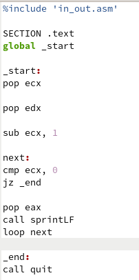

---
## Front matter
title: "Отчёт по лабораторной работе №8"
subtitle: "Простейший вариант"
author: "Янушкевич Михаил денисович"

## Generic otions
lang: ru-RU
toc-title: "Содержание"

## Bibliography
bibliography: bib/cite.bib
csl: pandoc/csl/gost-r-7-0-5-2008-numeric.csl

## Pdf output format
toc: true # Table of contents
toc-depth: 2
lof: true # List of figures
lot: true # List of tables
fontsize: 12pt
linestretch: 1.5
papersize: a4
documentclass: scrreprt
## I18n polyglossia
polyglossia-lang:
  name: russian
  options:
	- spelling=modern
	- babelshorthands=true
polyglossia-otherlangs:
  name: english
## I18n babel
babel-lang: russian
babel-otherlangs: english
## Fonts
mainfont: PT Serif
romanfont: PT Serif
sansfont: PT Sans
monofont: PT Mono
mainfontoptions: Ligatures=TeX
romanfontoptions: Ligatures=TeX
sansfontoptions: Ligatures=TeX,Scale=MatchLowercase
monofontoptions: Scale=MatchLowercase,Scale=0.9
## Biblatex
biblatex: true
biblio-style: "gost-numeric"
biblatexoptions:
  - parentracker=true
  - backend=biber
  - hyperref=auto
  - language=auto
  - autolang=other*
  - citestyle=gost-numeric
## Pandoc-crossref LaTeX customization
figureTitle: "Рис."
tableTitle: "Таблица"
listingTitle: "Листинг"
lofTitle: "Список иллюстраций"
lotTitle: "Список таблиц"
lolTitle: "Листинги"
## Misc options
indent: true
header-includes:
  - \usepackage{indentfirst}
  - \usepackage{float} # keep figures where there are in the text
  - \floatplacement{figure}{H} # keep figures where there are in the text
---

# Цель работы

Приобретение навыков написания программ с использованием циклов и обработкой
аргументов командной строки.

# Выполнение лабораторной работы

1.  Создать каталог ЛБ №8. В нём создать файл lab8-1.asm.(рис. @fig:001)

{#fig:001 width=70%}

С помощью команды mkdir создаём каталог каталог для программ лабораторной работы #8. Переходим в него и с помощью команды touch создаём файл lab8-1.asm.

2. В файл lab8-1.asm ввести код программы из листинга 8.1.рис.(@fig:002)

{#fig:002 width=70%}

С помощью текстового редактора открываем файл lab8-1.asm, далее в него вводим текст программы из листинга 8.1.

3. Создать исполняемый файл и проверить его работу.(рис. @fig:003)

{#fig:003 width=70%}

В командную строку вводим команды, чтобы создать исполняемый файл. Далее запускаем его. Результатом работы программы стала последовательность чисел от 11 до 1.

4. Изменить текст программы.(рис. @fig:004)

{#fig:004 width=70%}

В файле lab8-1.asm изменяем текст программы, добавив изменение значения регистра ecx в цикле.

5. Создать исполняемый файл и проверить его работу.(рис. @fig:005)

{#fig:005 width=70%}

В командную строку вводим необходимые команды, чтобы создать исполняемый файл. Далее запускаем программу. Результатом работы программы стала последовательность нечетных чисел от 14 до 1. Число проходов цикла не соответствует введенному числу.

6. Изменить текст программы.(рис. @fig:006)

{#fig:006 width=70%}

В файле lab8-1.asm изменяем текст программы, добавив команды push и pop.

7. Создать исполняемый файл и проверить его работу.(рис. @fig:007)

{#fig:007 width=70%}

В командную строку вводим необходимые команды, чтобы создать исполняемый файл. Далее запускаем программу. Результатом работы программы стала последовательность чисел от 11 до 0. Число проходов цикла соответствует введенному числу.

8. Создать файл lab8-2.asm  и ввести в него текст программы из листинга 8.2.(рис. @fig:008)

{#fig:008 width=70%}

Создаём файл lab8-2.asm и вводим в него текст программы листинга 8.2.

9. Создать исполняемый файл и проверить его работу.(рис. @fig:009)

{#fig:009 width=70%}

В командную строку вводим необходимые команды, чтобы создать исполняемый файл. Далее запускаем программу. Результатом работы программы стали 4 аргумента.

10. Создать файл lab8-3.asm и ввести в него текст программы и листинга 8.3.(рис. @fig:010)

{#fig:010 width=70%}

Создаём файл lab8-3.asm и в нем вводим текст программы листинга 8.3.

11. Создать исполняемый файл и проверить его работу.(рис. @fig:011)

{#fig:011 width=70%}

В командную строку вводим необходимые команды, чтобы создать исполняемый файл. Далее запускаем программу. Результатом работы программы стала сумма введенных аргументов: число 47.

12. Изменить текст программы для вычисления произведения аргументов.(рис. @fig:012)

{#fig:012 width=70%}

В файле lab8-3.asm изменяем текст программы для вычисления произведения аргументов. 

13. Создать исполняемый файл и проверить его работу.(рис. @fig:013)

{#fig:013 width=70%}

В командную строку вводим необходимые команды, чтобы создать исполняемый файл. Далее запускаем программу. Результатом работы программы стало произведение введенных аргументов: число 54600.

# Задание для самостоятельной работы

1. Напишите программу, которая находит сумму значений функции f(x) для
x = x1, x2 ...xn. (рис. @fig:014)

{#fig:014 width=70%}

Создаём файл lab8-4.asm, в нём пишем необходимую программу в соответствии с моим вариантом функции(мой вариант-1). Функция вида f(x)=2x+15. 

2. Создать исполняемый файл и проверить его работу.(рис. @fig:015)

{#fig:015 width=70%}

В командную строку вводим необходимые команды, чтобы создать исполняемый файл. Далее запускаем программу. Результатом работы программы для x = 1 2 3 4 стало число 80, а для x = 1 3 5 7 стало число 92. Проверив полученные значения можно понять, что программа написана верно.

# Выводы

Благодаря этой лабораторной работе я приобрел навыки по использованию циклов, а также научился работать с аргументами, введенными в командную строку.

# Список литературы{.unnumbered}

::: {#refs}
:::
