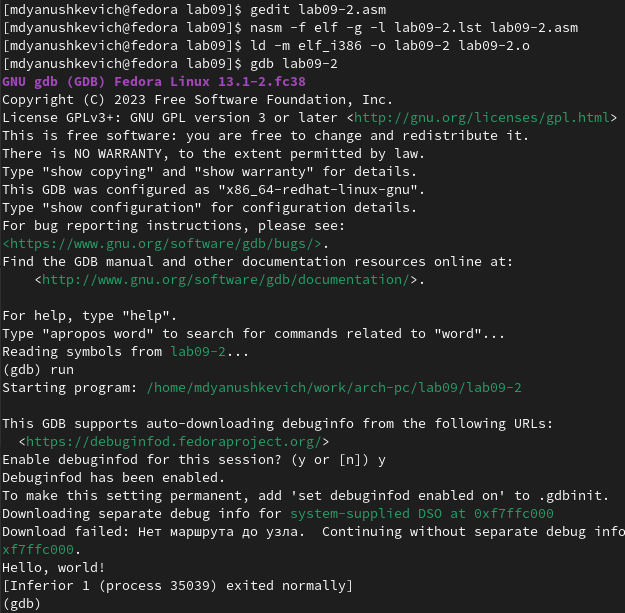
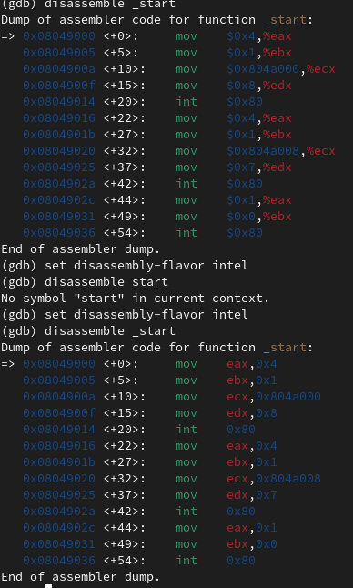
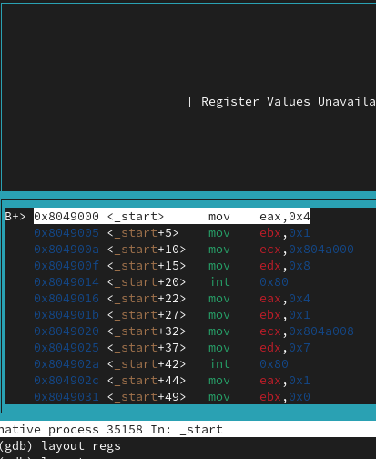
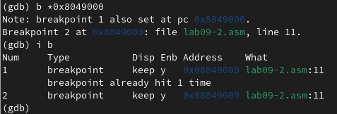
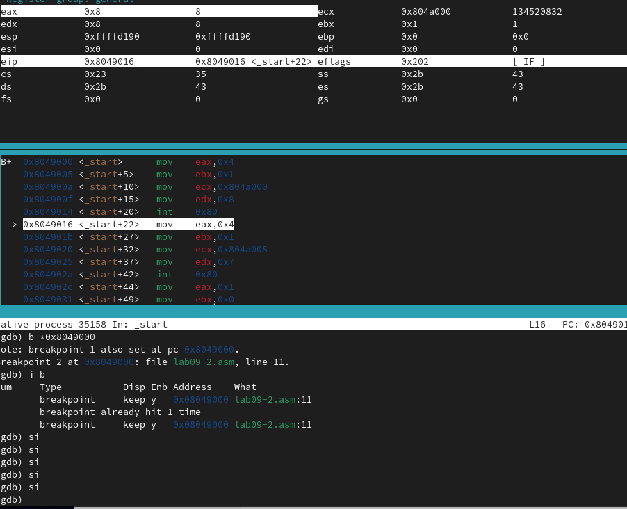
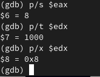
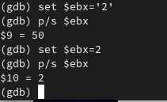
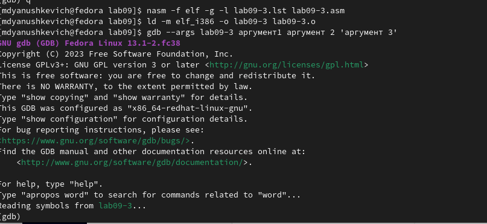
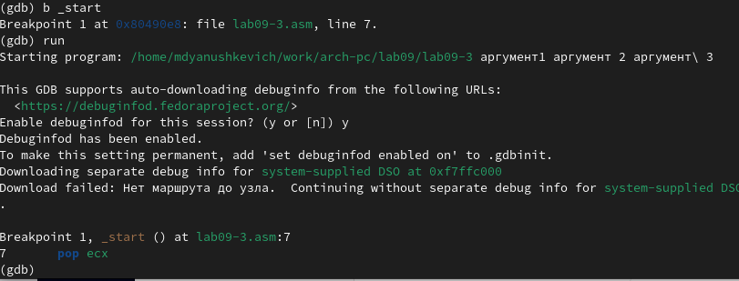

---
## Front matter
title: "Отчёт по лабораторной работе №9"
subtitle: "Простейший вариант"
author: "Янушкевич Михаил Денисович"

## Generic otions
lang: ru-RU
toc-title: "Содержание"

## Bibliography
bibliography: bib/cite.bib
csl: pandoc/csl/gost-r-7-0-5-2008-numeric.csl

## Pdf output format
toc: true # Table of contents
toc-depth: 2
lof: true # List of figures
lot: true # List of tables
fontsize: 12pt
linestretch: 1.5
papersize: a4
documentclass: scrreprt
## I18n polyglossia
polyglossia-lang:
  name: russian
  options:
	- spelling=modern
	- babelshorthands=true
polyglossia-otherlangs:
  name: english
## I18n babel
babel-lang: russian
babel-otherlangs: english
## Fonts
mainfont: PT Serif
romanfont: PT Serif
sansfont: PT Sans
monofont: PT Mono
mainfontoptions: Ligatures=TeX
romanfontoptions: Ligatures=TeX
sansfontoptions: Ligatures=TeX,Scale=MatchLowercase
monofontoptions: Scale=MatchLowercase,Scale=0.9
## Biblatex
biblatex: true
biblio-style: "gost-numeric"
biblatexoptions:
  - parentracker=true
  - backend=biber
  - hyperref=auto
  - language=auto
  - autolang=other*
  - citestyle=gost-numeric
## Pandoc-crossref LaTeX customization
figureTitle: "Рис."
tableTitle: "Таблица"
listingTitle: "Листинг"
lofTitle: "Список иллюстраций"
lotTitle: "Список таблиц"
lolTitle: "Листинги"
## Misc options
indent: true
header-includes:
  - \usepackage{indentfirst}
  - \usepackage{float} # keep figures where there are in the text
  - \floatplacement{figure}{H} # keep figures where there are in the text
---

# Цель работы

Приобретение навыков написания программ с использованием подпрограмм. Знакомство
с методами отладки при помощи GDB и его основными возможностями

# Выполнение лабораторной работы

1. Создать каталог для ЛБ9, в нём создать файл lab09-1.asm.(рис. @fig:001)

{#fig:001 width=70%}

С помощью команды touch создаём файл lab09-1.asm.

2. В файл lab09-1.asm ввести программу из листинга 9.1.(рис.(@fig:002)

{#fig:002 width=70%}

Вводим в файл lab09-1.asm текст программы из листинга 9.1.

3. Создать исполняемый файл, проверить его работу.(рис. @fig:003)

{#fig:003 width=70%}

Вводим необходимые команды, чтобы создать исполняемый файл. Проверяем его работу.

4. Изменить текст программы(рис. @fig:004)

{#fig:004 width=70%}

в файл lab09-1.asm вносим необходимые изменения, добавив подпрограмму _subcalcul в подпрограмму _calcul.

5. Создать исполняемый файл, проверить его работу.(рис. @fig:005)

{#fig:005 width=70%}

Вводим необходимые команды, чтобы создать исполняемый файл. Проверяем его работу. Число 17 является правильным ответом.

6. Создать файл lab09-2.asm, ввести в него текст программы листинга 9.2.(рис. @fig:006)

{#fig:006 width=70%}

Создаём файл lab09-2.asm, в него вводим код из листинга 9.2.

7. Получить исполняемый файл, проверить его работу.(рис. @fig:007)

{#fig:007 width=70%}

Для работы с GDB в исполняемый файл необходимо добавить отладочную информацию, для этого вводим ключ -g. Загружаем файл в отладчик GDB, запускаем с помощью команды run.

8. Установить брейкпоинт, запустить программу.(рис. @fig:008)

{#fig:008 width=70%}

С помощью команды break _start устанавливаем брейкпоинт. С помощью команды run запускаем программу.

9. Посмотреть дисассимилированный код программы, переключиться на отображение команд с INTEL'овским синтаксисом.(рис. @fig:009)

{#fig:009 width=70%}

С помощью команды disassemble просматриваем дисассимилированный код. Далее переключаем синтаксис с помощью команды set.

10. Включить режим псевдографики.(рис. @fig:010)

{#fig:010 width=70%}

Вводим необходимые команды для включения режима псевдографики.

11. Проверить точку останова.(рис. @fig:011)

{#fig:011 width=70%}

С помощью команды breakpoints проверяем точку останова.

12. Определить адрес предпоследней инструкции и установаить точку останова, посмотреть информацию о всех установленных точках останова.(рис. @fig:012)

{#fig:012 width=70%}

С помощью команды break устанавливаем точку останова, с помощью команды i b просматриваем информацию о других точках.

13. Выполнить 5 инструкций, проследить за изменением значений регистров.(рис. @fig:013)

{#fig:013 width=70%}

С помощью команды si просматриваем изменение значений регистров. Изменяются eax,ebx,ecx,edx.

14. Просмотреть значение переменной msg1.(рис. @fig:014)

{#fig:014 width=70%}

Вводим необходимую команду,смотрим значение переменной.

15. Просмотреть значение переменной msg2.(рис. @fig:015)

{#fig:015 width=70%}

Вводим необходимую команду, смотрим значение переменной.

16. Изменение первого символа переменной msg1.(рис. @fig:016)

{#fig:015 width=70%}

С помощью команды set изменяем символ 'H' на 'h'.

17. Изменение любого символа переменной msg2.(рис. @fig:017)

{#fig:017 width=70%}

С помощью команды set изменяем несколько символов в переменной msg2.

18. Вывести регистр edx в различных форматах.(рис. @fig:018)

{#fig:018 width=70%}

Выводим значение регистра edx с шестнадцатеричном, двоичном и символьном форматах.

19. Изменение значения регистра ebx.(рис. @fig:019)

{#fig:019 width=70%}

С помощью команды set изменяем значение регистра ebx.

20. Скопировать файл lab8-2.asm, создать исполняемый файл, загрузить в GDB.(рис. @fig:020)

{#fig:020 width=70%}

Копируем файл lab8-2.asm, создаём исполняемый файл, загружаем в GDB, используя ключ --args.

21. Установка точки останова, запуск инструкции.(рис. @fig:021)

{#fig:021 width=70%}

Устанавливаем точку останова, запускаем инструкцию с помощью команды run.

22. Посмотреть все позиции стека в регистре esp.(рис. @fig:022)

{#fig:022 width=70%}

С помощью определенных команд просматриваем все позиции стека в регистре esp, находящиеся в памяти. 

# Задание для самостоятельной работы

1.  Создать файл lab09-4.asm.(рис. @fig:023)

{#fig:023 width=70%}

С помощью команды touch создать файл lab09-4.asm.

# Выводы

Благодаря этой лабораторной работе я приобрёл навыки по использованию GDB, и с помощью неё смог ознакомился с методами отладки программ. Также смог написать программы с использованием подпрограмм.

# Список литературы{.unnumbered}

::: {#refs}
:::
