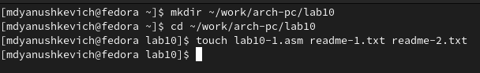
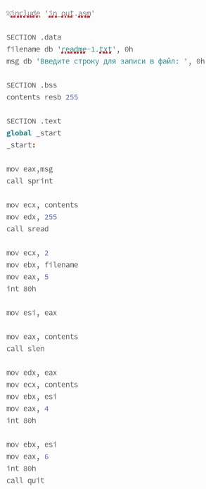
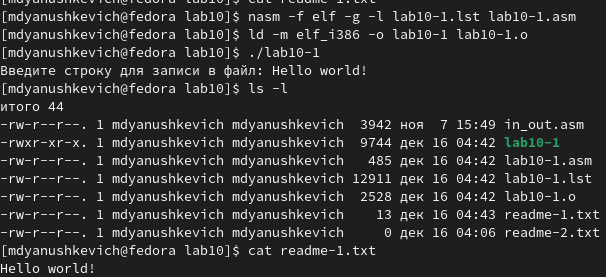
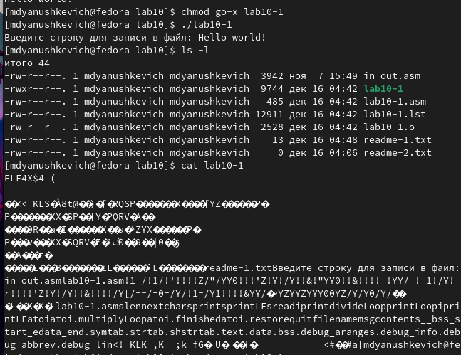
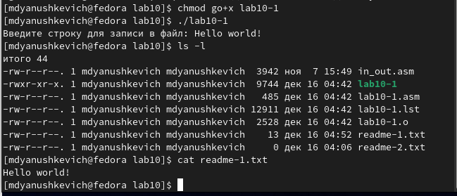
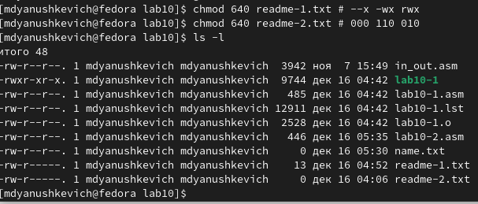
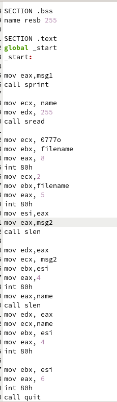
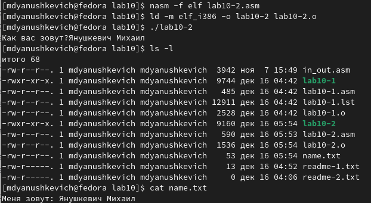

---
## Front matter
title: "Отчёт по лабораторной работе №10"
subtitle: "Простейший вариант"
author: "Янушкевич Михаил Денисович"

## Generic otions
lang: ru-RU
toc-title: "Содержание"

## Bibliography
bibliography: bib/cite.bib
csl: pandoc/csl/gost-r-7-0-5-2008-numeric.csl

## Pdf output format
toc: true # Table of contents
toc-depth: 2
lof: true # List of figures
lot: true # List of tables
fontsize: 12pt
linestretch: 1.5
papersize: a4
documentclass: scrreprt
## I18n polyglossia
polyglossia-lang:
  name: russian
  options:
	- spelling=modern
	- babelshorthands=true
polyglossia-otherlangs:
  name: english
## I18n babel
babel-lang: russian
babel-otherlangs: english
## Fonts
mainfont: PT Serif
romanfont: PT Serif
sansfont: PT Sans
monofont: PT Mono
mainfontoptions: Ligatures=TeX
romanfontoptions: Ligatures=TeX
sansfontoptions: Ligatures=TeX,Scale=MatchLowercase
monofontoptions: Scale=MatchLowercase,Scale=0.9
## Biblatex
biblatex: true
biblio-style: "gost-numeric"
biblatexoptions:
  - parentracker=true
  - backend=biber
  - hyperref=auto
  - language=auto
  - autolang=other*
  - citestyle=gost-numeric
## Pandoc-crossref LaTeX customization
figureTitle: "Рис."
tableTitle: "Таблица"
listingTitle: "Листинг"
lofTitle: "Список иллюстраций"
lotTitle: "Список таблиц"
lolTitle: "Листинги"
## Misc options
indent: true
header-includes:
  - \usepackage{indentfirst}
  - \usepackage{float} # keep figures where there are in the text
  - \floatplacement{figure}{H} # keep figures where there are in the text
---

# Цель работы

Приобретение навыков написания программ для работы с файлами.

# Выполнение лабораторной работы

1.  Создать каталог ЛБ №10. В нём создать файл lab10-1.asm.(рис. @fig:001)

{#fig:001 width=70%}

С помощью команды mkdir создаём каталог каталог для программ лабораторной работы №10. Переходим в него и с помощью команды touch создаём файл lab10-1.asm.

2. В файл lab10-1.asm ввести код программы из листинга 10.1.рис.(@fig:002)

{#fig:002 width=70%}

С помощью текстового редактора открываем файл lab10-1.asm, далее в него вводим текст программы из листинга 10.1.

3. Создать исполняемый файл и проверить его работу.(рис. @fig:003)

{#fig:003 width=70%}

В командную строку вводим команды, чтобы создать исполняемый файл. Далее запускаем его. Вводим в строку ввода Hello world!, читаем файл и видим, что команда выполнилась правильно.

4. Изменить права доступа к файлу lab10-1.asm.(рис. @fig:004)

{#fig:004 width=70%}

С помощью команды chmod запрещаем выполнение  файла lab10-1.asm. Далее запускаем его и понимаем, что вместо содержимого выводится случайная информация и символы.

5.  Изменить права доступа к файлу lab10-1.asm.(рис. @fig:005)

{#fig:005 width=70%}

С помощью команды chmod разрешаем выполнение файла lab10-1.asm, запускаем файл. Выводится Hello world!, что означает, что всё работает исправно, доступ к файлу разрешен. 

6. В соответствии со своим вариантом предоставить права доступа в символьным и двоичном вариантах к файлам readme-1.txt и readme-2.txt.(рис. @fig:006)

{#fig:006 width=70%}

С помощью команды chmod предоставляю доступ в соответствии с 1 вариантом в символьном виде для файла readme-1.txt, а для файла readme-2.txt в двоичном виде. С помощью команд cat и ls -l убеждаюсь в правильности выполнения.

#Задание для самостоятельной работы

1. Написать программу, работающую по следующему алгоритму.(рис. @fig:007)

{#fig:007 width=70%}

Создаём файл lab10-2.asm и вводим в него текст программы, редактируя код для записи в файл name.txt моего имени, введенного в командной строке.

2. Создать исполняемый файл и проверить его работу.(рис. @fig:008)

{#fig:008 width=70%}

В командную строку вводим необходимые команды, чтобы создать исполняемый файл. Далее запускаем программу.С помощью команд cat и ls - убеждаемся в правильности выполнения. Моё имя успешно записалось в файл и вывелось.

# Выводы

Благодаря этой лабораторной работе я приобрел навыки по работе с инструментами, необходимыми для создания файла и ввода в него необходимой информации, а также написал программу, работающую с файлами. 

# Список литературы{.unnumbered}

::: {#refs}
:::
